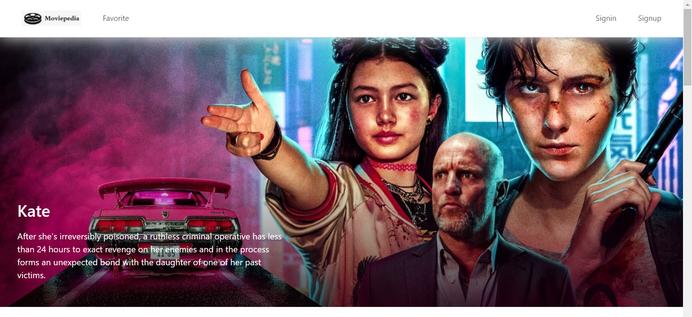
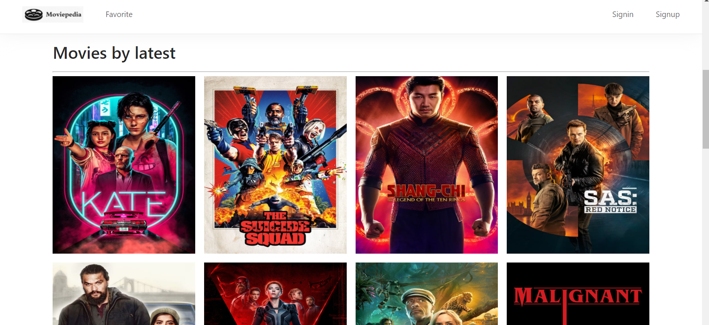
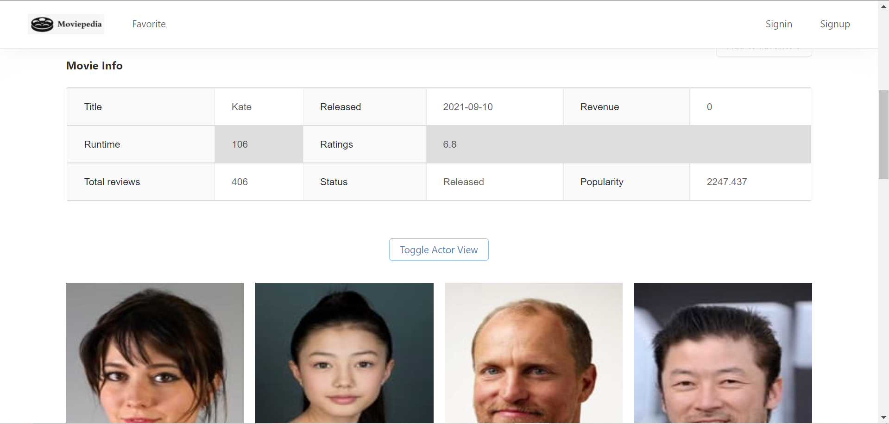
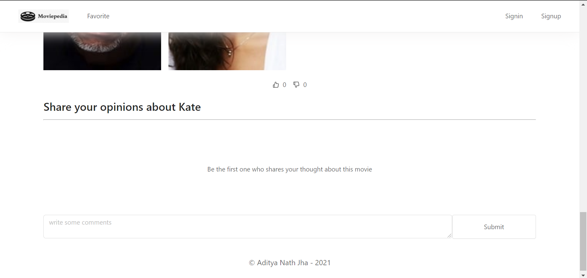
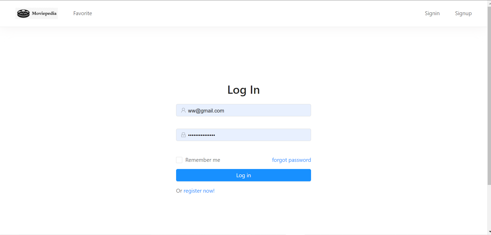
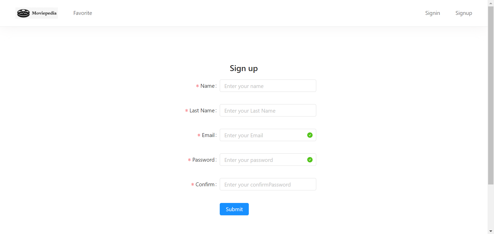

# Moviepedia
A MERN stack web application for movie database. 

Used [themoviedb](https://www.themoviedb.org/) website's API to fetch information.

Use - `npm run dev` to connect to localhost server. 
### (Still in development mode... Bug fixes and updates required!)

## Screenshots: 

Landing Page  

Movies by latest  

Movies Info(1)  

Movies Info(2)  

Log In Page  

Sign Up Page  

